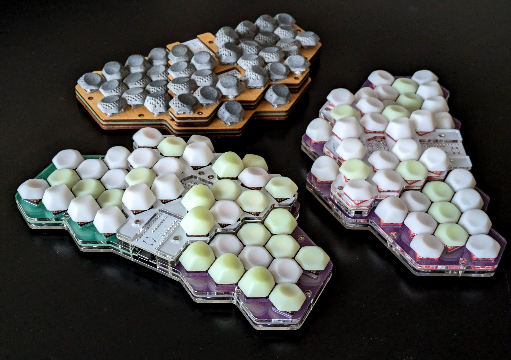
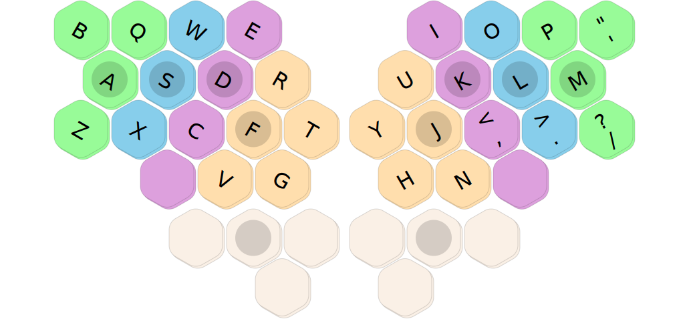
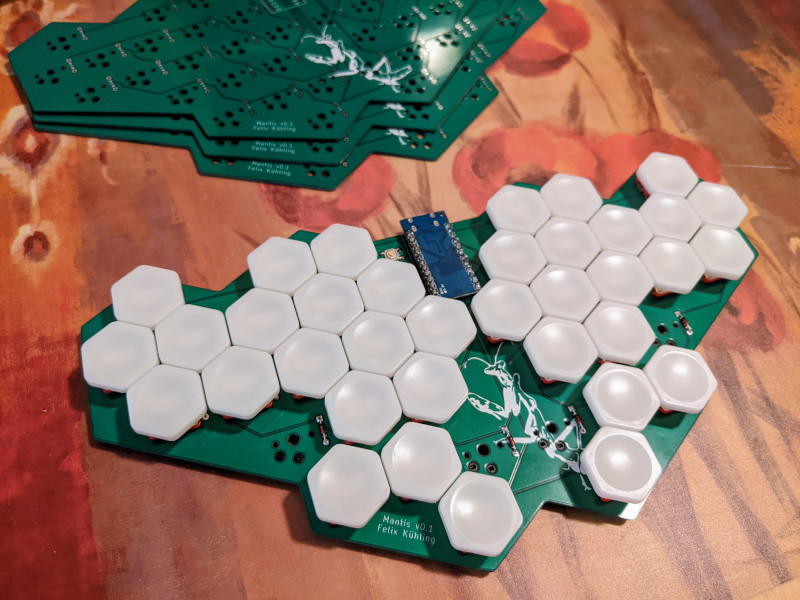
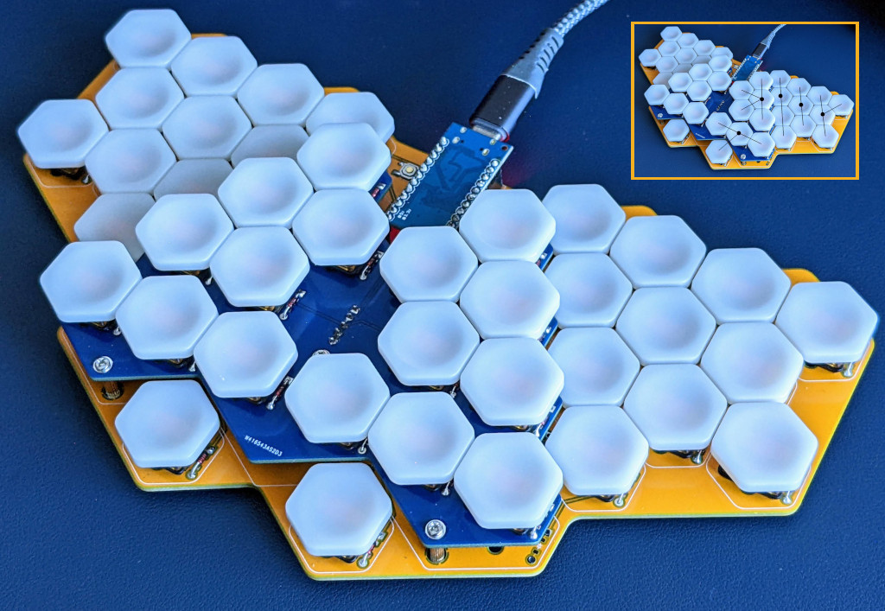

# Mantis hex ergo keyboard

>
>_Three different builds of Mantis v0.3.3, experimenting with different case and key cap materials_

## Contents

Mantis is an ergonomic keyboard designed around hexagonal keys.

This repository contains Ergogen, KiCad and OpenSCAD files for the PCBs, case and key caps, as well as a [build guide](./buildguide.md). You can print a [one-page reference and quick start guide](https://github.com/fxkuehl/mantis/blob/main/keymap.pdf) of the default keymap.

Mantis is approaching the end of the prototyping phase, currently at version v0.3.3. You can check the git history for older prototype versions.

Mantis v0.3.3 consists of three PCBs. Two identical [bottom PCBs](https://github.com/fxkuehl/mantis/raw/main/pcb/gerber/mantis-v0.3-bottom.zip) are reversible. The [central PCB](https://github.com/fxkuehl/mantis/raw/main/pcb/gerber/mantis-v0.3.3-top.zip) is stacked on top with M2 standoffs and headers to create an approximation of two tented, shallow key wells together with the [sculpted 3D printed keycaps](https://github.com/fxkuehl/mantis/tree/main/keycap) and the rotation of switches.

v0.3.3 also includes [DXF files](https://github.com/fxkuehl/mantis/tree/main/plates/v0.3.3) for laser-cut plates. I have built keyboards with 3mm thick acrylic and birch plywood plates, manufactured at Hot Pop Factory in Toronto.

## Build Guide

See the [complete build guide](./buildguide.md) for detailed instructions and all the tools, materials, and parts required.

## Firmware and Keymap

Firmware is available in my [QMK fork](https://github.com/fxkuehl/qmk_firmware/tree/mantis-vial-v0.3/keyboards/mantis). It is now based on the Vial version of QMK, so you can use the [Vial](https://get.vial.today/) GUI to customize the keymap more easily.

# Concept

Mantis is a compact unibody ergo keyboard approximating 15° tented, shallow key wells using two layers of flat PCBs and custom sculpted hexagonal key caps. The hex grid naturally results in 30° hand rotation and aggressive column stagger. Hexagonal keys can rotate in 60° increments, which enables a decent approximation of key wells with only one or two unique keycap shapes. Existing 3x5+3 split layouts with 36 keys should be adaptable for this keyboard.

I recorded a short [YouTube video](https://www.youtube.com/watch?v=Rh3bqSVHcbg) to demonstrate the usability and comfort.

>_Mapping QWERTY to the Mantis layout with staggered columns rotated 30° inwards_

Due to the way that columns of hexagonal keys are staggered, the index fingers only have five keys, while the pinkies can get one extra key that is comfortable to reach with splay. This requires some layout modifications when mapping QWERTY (or your favourite alternative layout) to this keyboard.

I wrote a [longer article](https://kbd.news/Mantis-Hexagonal-Keys-in-Ergonomic-Keyboards-2202.html) about the ergonomics of the layout and the motivation for trying hexagonal keys for the [kbd.news](https://kbd.news/) 2023 advent calendar.

## Evolution

>

The first prototype v0.1 was inspired by [FK Keycaps HEX](https://fkcaps.com/keycaps/hex) keycaps. It served as a proof of concept of an ergonomic layout using hexagonal keys and gave me ideas for future revisions. This lead to the raised center and modified pinkie key layout in v0.2.

>

The raised center in v0.2 adds tenting and makes the index finger keys easier to reach. It also improves the spacing an usability of the thumb keys. I experimented with different mounting methods for stacking two PCBs, and tried different heights. Although usable and my daily driver for several months, this version still had problems with finger travel distance and accidental adjacent key presses.

These problems were addressed in v0.3 with a custom 3D-printed key profile and switch rotation. v0.3 also added per-key RGB backlight and a laser-cut sandwich case. The latest PCB and case version v0.3.3 has some refinements of the fit, changes the rotation of two keys on the upper PCB and adds support for RGB LEDs with 3.3V controllers.

The name Mantis comes from the shape of the PCB resembling a mantis head and the hexagonal keys suggesting compound eyes.