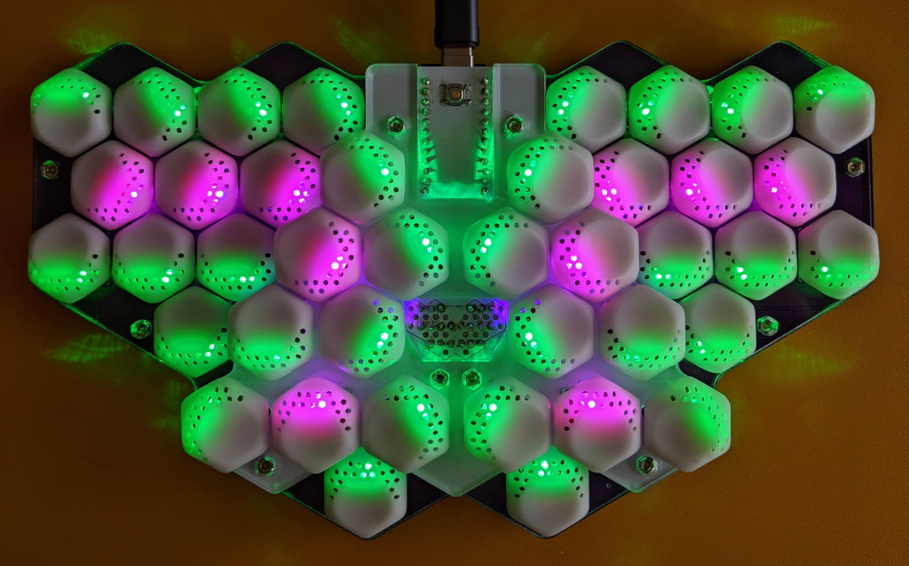

# Mantis hex ergo keyboard

>
>_Finished v0.2 prototype, PCBs stacked with 8mm headers_

## Contents

This repository contains Ergogen, KiCad and OpenSCAD files for the PCB and case design and key caps, as well as this readme with some basic information. Mantis is still in the prototyping phase, currently at version is v0.3. You can check the git history for older prototype versions.

Mantis v0.3 consists of three PCBs. Two identical bottom PCBs are reversible. The top PCB is stacked on top with M2 standoffs and headers to create an approximation of two tented, shallow key wells together with the sculpted 3D printed key caps and the rotation of switches. Thank you to [PCBWay](https://www.pcbway.com/) for sponsoring the PCB and key cap production for my prototypes since v0.2.

v0.3 also includes DXF files for laser-cut plates. My prototype build uses 3mm thick acrylic plates for all layers, manufactured at Hot Pop Factory in Toronto.

## Build Guide

A complete build guide for v0.3 is in progress. Meanwhile, here is a full parts:

- 1x upper PCB
- 2x lower PCBs
- 40x custom 3D printed keycaps (FK Keycaps Hex keys also work but not ideal)
- Case plates (3mm. If different thickness is used, you may need to use different headers and standoffs)
    - 1x base plate
    - 1x lower sound plate
    - 1x lower switch plate
    - 2x upper sound plate
    - 1x upper switch plate
- 1x ProMicro or pin-compatible controller
- 1x reset switch
- 40x SMD diodes
- Up to 40 LEDs (SK6812 MINI-E)
- 40x Choc v1 switches
- Headers: (8mm headers work if you mount the male headers from the bottom of the lower PCB, pushing the pins all the way through. 5mm short headers sold by AdaFruit would be less janky)
    - 2x 12-pin headers for controllers
    - 2x 3-pin, 1x 8-pin, 1x 6-pin headers for connecting the upper and lower PCBs
- 12x 3mm knurled M2 male-female standoffs
- 6x 9mm knurled metal M2 male-female standoffs (don't use plastic standoffs, they are needed to connect GND between the PCBs)
- 12x M2 screws
- 12x M2 hex nuts
- Adhesive rubber feet

### Optional components

The reset switch is optional. You can reset the controller for loading new firmware by shorting the GND and RST pins with a paper clip or a short wire or by adding a RESET key to your keymap.

The case plates are optional. If you're building Mantis without a case you also don't need the 3mm standoffs. Just put rubber feed directly on the lower PCB. Make sure to support the center of the keyboard with rubber feet to avoid unnecessary stress on the split bottom PCBs.

The chaining of LEDs enables a few options for populating RGB LEDs:

- None
- 6: top center keys only
- 16: all keys on the upper PCB
- 40: all keys

## Firmware

Firmware is available in my [QMK fork](https://github.com/fxkuehl/qmk_firmware/tree/mantis-v0.3/keyboards/mantis).

## Concept

A compact unibody ergo keyboard with shallow tented key wells built using two layers of flat PCBs and custom sculpted hexagonal key caps. The hex grid naturally results in 30° hand rotation and aggressive column stagger that is close enough to anatomically reasonable (with aggressive pinky and index finger stagger and slightly exaggerated ring finger stagger). Existing 3x5+3 layouts with 36 keys should be adaptable for this keyboard.

>

>_Mapping QWERTY to the Mantis layout (WIP screenshot from Vial), illustrating the hand rotation and column stagger_

The inner index-finger column only has 2 keys. As a result the index finger has 5 keys instead of the usual 6. The non-home keys are all the same distance from the home key and should all be comfortable to reach. To make up for the missing index finger key, the pinky has one extra key that should be comfortably reachable with splay. In the QWERTY-based layout illustrated above, 'B' and 'M' move from the index fingers to the pinkies.

The hex keycaps have a relatively large footprint. But the custom 3D printed keys have a smaller spherical dish that is tilted and offset from the center towards the direction of finger travel. This results in finger travel distance similar to MX keys. The tilt and offset also direct the force to the center of the switch stem and results in smooth key actuation.

The raised part of the keyboard for index finger and most thumb keys results in a tented hand position of about 15° while adding to the approximation of a key well. It also creates a 2-tier thumb cluster that solves the thumb-key spacing problem of v0.1 and makes the fourth thumb key usable.

The first prototype v0.1 served as a proof of concept and gave me ideas for future revisions, such as the raised center and modified pinky key layout in v0.2. Although usable and my daily driver for several months, this version still had problems with finger travel distance and accidental adjacent key presses that were addressed in v0.3 with the custom 3D-printed key profile and switch rotation.

The name Mantis comes from the shape of the PCB resembling a mantis head and the hexagonal keys suggesting compound eyes.

## Attribution

Thank you to [PCBWay](https://www.pcbway.com/) for sponsoring this project by covering the cost of PCB manufacturing for v0.2 as well as PCB and key cap manufacturing for v0.3. I already knew their PCBs are great quality from v0.2. The 3D printed key caps in v0.3 turned out great, with good details, surface texture and strength, especially around the small Choc switch stems.

The mantis picture on the front of the v0.1 PCB is a modified and vectorized version of [this photo](https://wordpress.org/openverse/image/07787e94-05c0-4aa9-a530-9cb8ce2a4666) by Flickr user HolleyandChris.