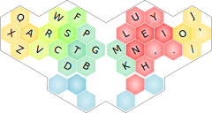

# Mantis hex ergo keyboard

>
>_Finished v0.2 prototype, PCBs stacked with 8mm headers_

## Contents

This repository contains Ergogen and KiCad files for the PCB design, as well as this readme with some basic information. Mantis is still in the prototyping phase, currently at version is v0.2. You can check the git history for older prototype versions.

Mantis v0.2 consists of two PCBs that are stacked with headers and M2 stand-offs to create an approximation of a key well. Thank you to [PCBWay](https://www.pcbway.com/) for sponsoring the PCB production of this prototype.

## Components

In addition to the PCBs you need these components to build a working keyboard:

* 1x Pro-Micro or compatible controller
* 40x Kailh Choc hotswap sockets
* 40x Kailh Choc v1 switches
* 40x diodes (SMD or through-hole)
* 40x FK-Keycaps Hex Caps
* 1x reset switch (optional)
* 4x 2-pin and 1x 5-pin male and female headers to connect the two PCBs (optional)
* 5x M2 stand-offs + screws/nuts (optional)
* Adhesive rubber feet

### Optional components

The reset switch is optional. You can reset the controller for loading new firmware by shorting the GND and RST pins with a paper clip or a short wire.

The headers are optional. The base PCB has all the switch footprints so you can build a flat keyboard with it alone.

The M2 stand-offs are optional. Just the headers can hold the top PCB reasonably stable. I find that the stand-offs help with aligning everything properly while soldering, so that the adjacent keys don't collide with the center PCB. The stand-offs also make the keyboard more stable in use. You can also use different length stand-offs to adjust the height. I currently use 10mm stand-offs with standard 8mm headers. They are about 1/2 mm shorter than the combined male and female headers.

Adafruit sells 5mm headers that would work well with 8mm stand-offs. I'm planning to build another prototype with low-profile sockets and diode legs instead of headers to try out lower 3mm or 5mm stand-offs before settling on a case design for the next revision.

## Firmware

Firmware is available in my [QMK fork](https://github.com/fxkuehl/qmk_firmware/tree/mantis-v0.2/keyboards/mantis). TODO: Update link for v0.2.

## Concept

A unibody ergo keyboard using hexagonal key caps, placing the hands close together and rotating them 30°. The hex grid naturally results in aggressive column stagger that is close enough to anatomically reasonable (with aggressive pinky and index finger stagger and slightly exaggerated ring finger stagger). Existing 3x5+3 layouts with 36 keys should be adaptable for this keyboard.

>
>_Layout diagram of v0.1 of a modified Colemak-DH with minimal changes to accommodate fewer index-finger keys while preserving low same-finger bigrams. Color coding indicates angled and staggered columns in the left half and the shape of a hypothetical numpad on a layer in the right half_

The inner index-finger column only has 2 keys. As a result the index finger has 5 keys instead of the usual 6. The non-home keys are all the same distance from the home key and should all be comfortable to reach. To make up for the missing index finger key, the pinky has one extra key that should be comfortably reachable with splay.

The hexagonal keys have a large surface area that is approximately circular. This should make it harder to hit adjacent keys accidentally. The column spacing and finger travel distances are about 1mm more than on a row-staggered keyboard with MX keys. I may address this in a future version with custom 3D-printed keycaps and closer key spacing. So far the slightly larger key spacing is working well for my relatively small hands as all keys are within 1u from the home position.

The raised part of the keyboard for index finger and most thumb keys results in a slightly tented hand position while creating an approximation of a key well. It also creates a 2-tier thumb cluster that solves the thumb-key spacing problem of v0.1 and makes the fourth thumb key usable.

The first prototype v0.1 served as a proof of concept and gave me ideas for future revisions, such as the raised center and modified pinky key layout in v0.2. Other future improvements I would like to pursue include:

* Per-key RGB
* A case, either stacking more FR4 plates or 3D-printed
* 3D-printed sculpted key caps, maybe with closer key-spacing
* Maybe an integrated track pad

The name Mantis comes from the shape of the PCB resembling a mantis head and the hexagonal keys suggesting compound eyes.

## Attribution

The mantis picture on the front of the v0.1 PCB is a modified and vectorized version of [this photo](https://wordpress.org/openverse/image/07787e94-05c0-4aa9-a530-9cb8ce2a4666) by Flickr user HolleyandChris.

Thank you to [PCBWay](https://www.pcbway.com/) for sponsoring this project by covering the cost of PCB production for v0.2. The boards turned out very nicely, the stacked PCBs fit perfectly with tight clearances between the top PCB and adjacent keys. The yellow solder mask turned out more orange than I expected, but the result looks stunning IMO.