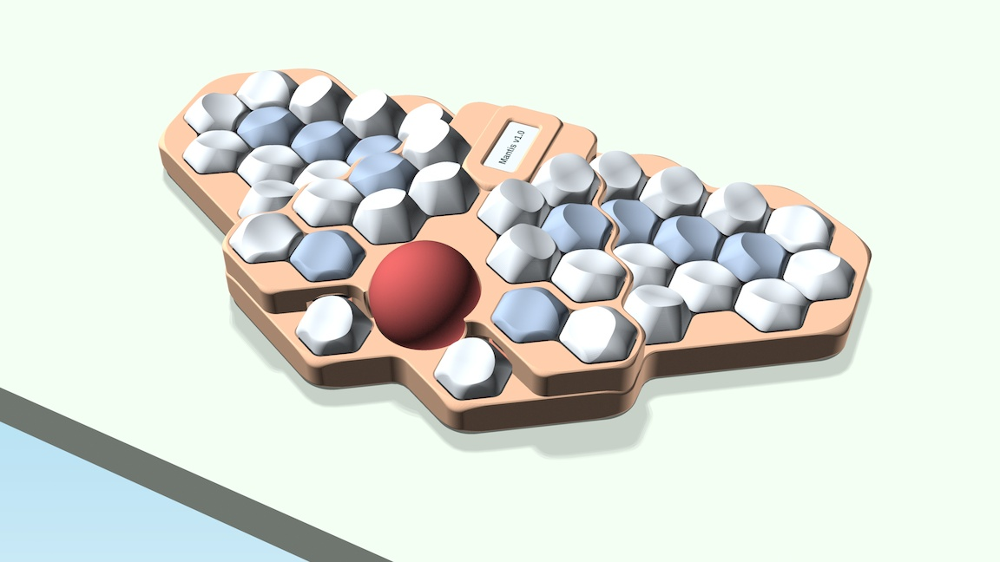
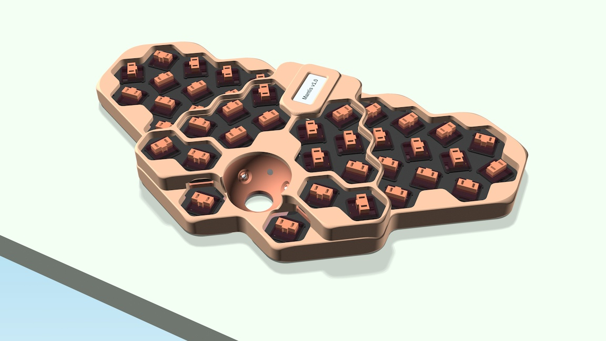
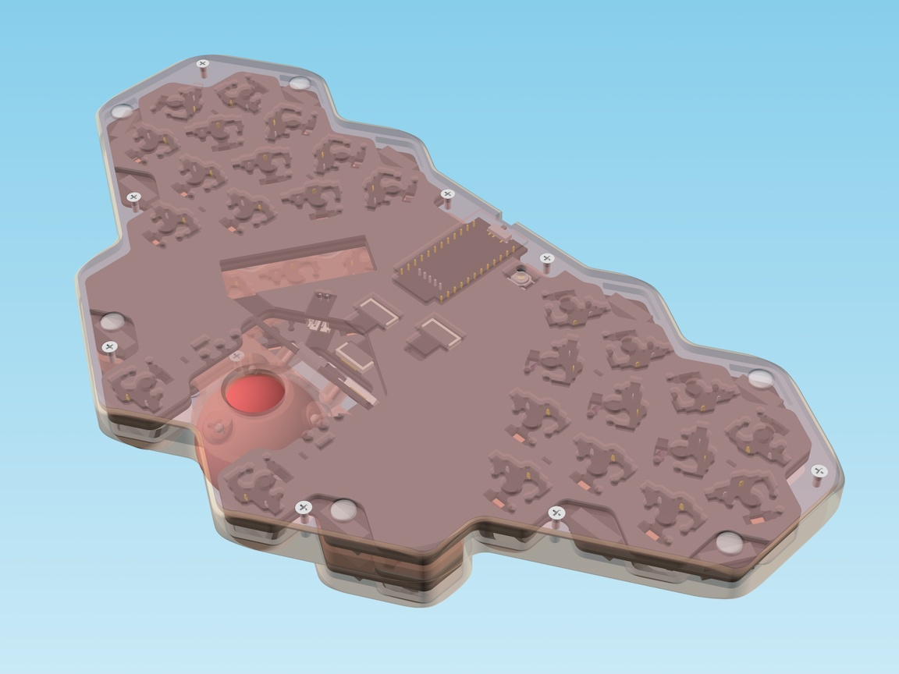
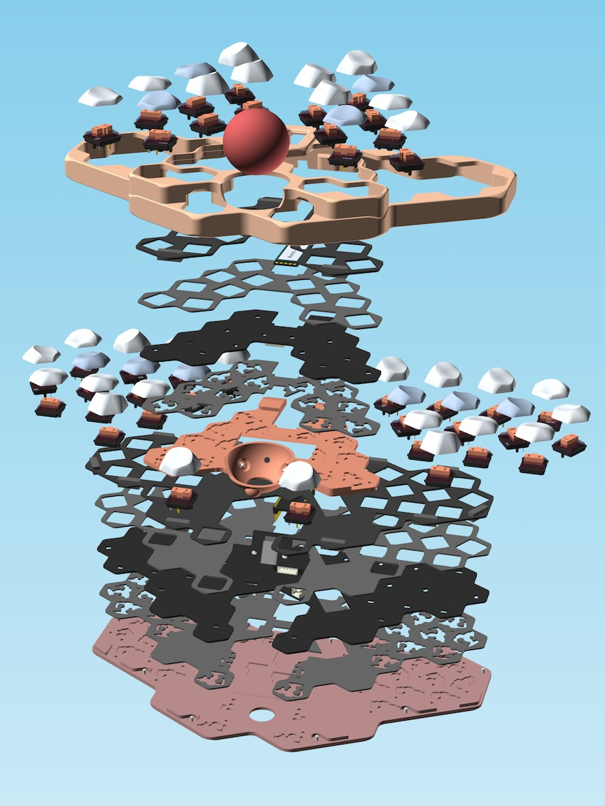
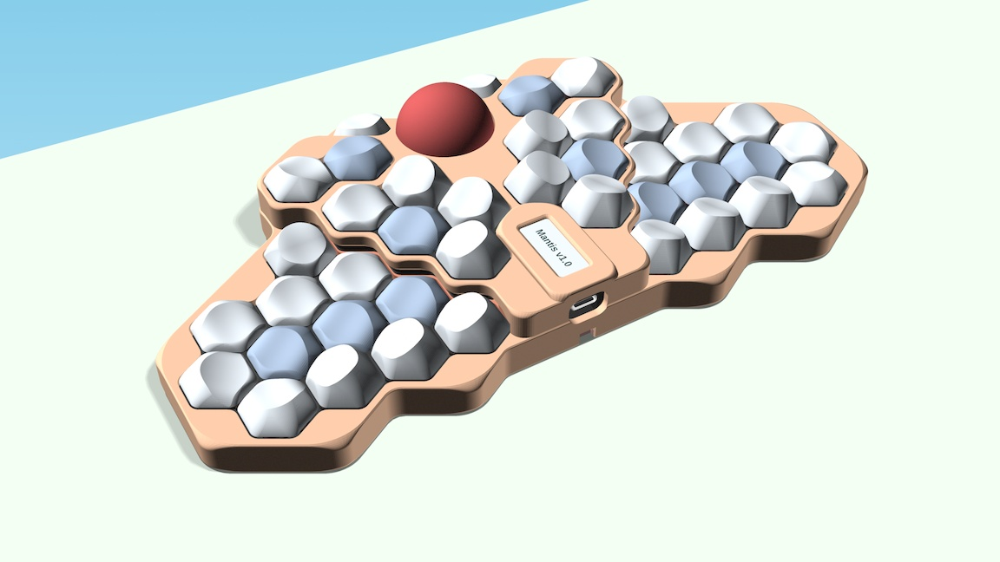
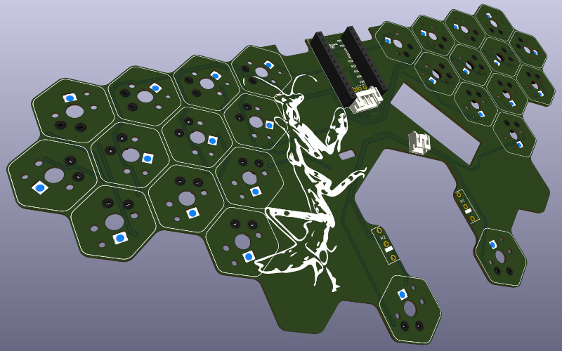
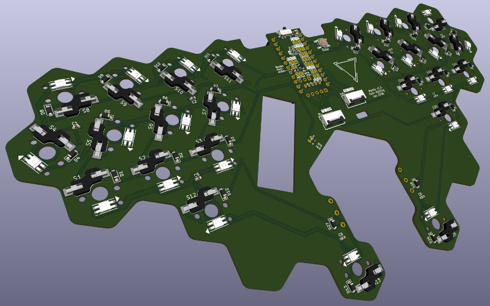
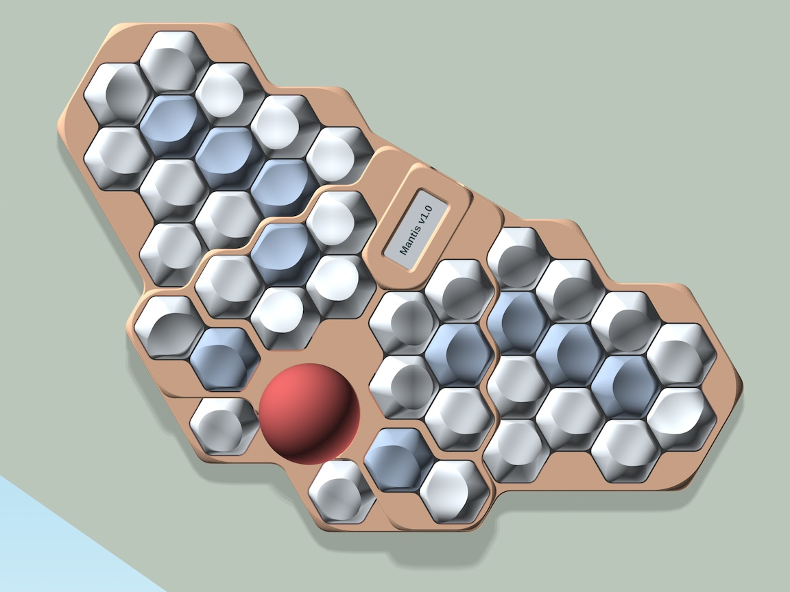

# Mantis hex ergo keyboard — Development branch

>

This is the development branch of Mantis. It's taking me way longer than expected to finish version 1.0 for various reasons—including my day job, other hobbies, some pretty ambitious design goals, and having too much fun making the renders look pretty. But I am getting closer to the finish line, so it's a good time to share an update in January 2026.

## What's unchanged since v0.3

>

The basic recipe is still the same:

* Compact unibody keyboard with 40 sculpted hexagonal keys
* Simulated key wells using two layers of PCBs and rotated switches
* 30° hand rotation
* 15° tenting
* Choc switches
* Support for per-key RGB LEDs

## What's new in v1.0

>

These are mostly the features that I wanted v1.0 to have when I started working on it in November 2024:

* Integrated trackball or trackpad
* 3D-printed, fully enclosed case hiding switches
* Gasket mounted structure
* New saddle-shaped key cap profile
* Choc v1 and v2 switch compatibility
* Hot-swap
* Designed for easier assembly
* Support for wireless builds with nice!nano
* Support for wired builds with ProMicro-RP2040
* Support for nice!view display

Only the nice!view display option was a later addition as wireless support became a higher priority for me and I realized that RGB LEDs don't work well with small batteries.

## Details and trade-offs

I figured the trackball would be harder to design for than a cirque trackpad, so I started with the trackball design. Once I got down to the nuts and bolts, these were some of the decisions and trade-offs that emerged:

* Trackball: 34mm, static bearings, PMW3610 sensor
    - ambidextrous
    - placement and sensor angle work best for thumb use
    - low power sensor, suitable for wireless builds
    - unfortunately not supported by QMK, but ZMK also supports wired RP2040 controllers
* Losing two thumb keys to make room for the trackball
* Adding two pinky keys to maintain number of keys, provide more layout flexibility
* Gasket-mounted structure allows 1mm vertical movement before bottoming out
* Four 1mm foam or cork layers for sound dampening
* Enclosed case adds minimal bulk with 2.5mm wall thickness and tight tolerances
    - case adds only about 1.5mm total width and depth compared to v0.3
    - extra pinky keys add another 21.5mm total width
* Low-profile design: 2mm lower than v0.3, including the trackball, 6mm lower excluding trackball
    - counter-sunk screws
    - recessed feet
    - internal recesses in base plate and mezzanine for PCB components and pins
    - thinner PCBs and switch plates (1.2mm)
    - 60° angled sensor mount and opening in case bottom enable low trackball position
* Internal use of VIK connectors/cables/signaling (ready for future version with Cirque trackpad)
    - Custom sensor-board is not mechanically VIK-compatible due to space constraints
    - Using identical 12-pin FFC cables for VIK connection and upper keyboard-PCB connection
* PCB configuration through solder jumpers
    - not enough controller pins to support all VIK features + display + LEDs all at once
    - support for cirque trackpads (without VIK module) requires disconnecting VIK 5V and LED pins
    - power source selection for LEDs depending on the controller
* Intended for automated PCB-assembly
    - no manual SMD soldering required (hand-soldering FFC connectors would be a pain)
    - all SMD components placed on the bottom of the PCBs
    - still requires manual soldering of jumpers and through-hole components
* Easy controller socketing with standard pin-headers
* Battery compartment and connector
    - using common JST-PH 2mm-pitch connector
    - accessible without disassembly other than removing the base plate
    - enough room for 501240, 501235, 401230 or similar LiPo batteries
    - 100-200mAh should be good for several weeks on a charge
* Attempting crude ESD protection with a ferrite bead between ground plane and controller GND pins
    - proper ESD would involve a [Unified Daughterboard](https://unified-daughterboard.github.io/#/) and integrated controller, but I'm not ready to make that jump in v1.0

## What's done

>

Over the last year and 2 months I went through more than 140 revisions on this Git branch to get to this point:

* Closed most open design and fit issues
* Ergogen design of all the PCB, plate and foam outlines and PCB templates
* Parametric OpenSCAD model of the case for gasket-mounted trackball version
* Parametric OpenSCAD models of saddle-shaped key cap profile with Choc v1 and v2 stems
* Main PCB schematic and routing complete

 

## What's left to do

If I can check off each of the following TODO items in a weekend, I'll have the first working prototype ready by the spring equinox. This estimate is on the optimistic side, given my track record. But if all works without major setbacks, I expect to publish the complete design and a build guide some time this spring.

High-level TODO-list:

* Upper PCB schematic and routing
* Fix-up the sensor board with updated outline and schematic
* Experiment with panelization and V-cuts to make multi-PCB+plate production easier/cheaper
* Create the PCB production files, order PCBs and plates
* Find some local 3D-printing/laser cutting services or maker spaces to make the case and foam/cork layers
* Order all the additional parts
* Build a prototype or two
* Learn ZMK and create the firmware
* Pray that everything fits and works as designed

## What's next

While the gasket-mounted trackball version is meant to be my ideal home or office keyboard, I want to make the perfect on-the-go or travel keyboard next. The PCBs are already designed to support this, so it should only be a matter of a modified case design and parameters as well as a different firmware build:

* Switch plates integrated into the case
    - more sturdy
    - easier assembly
    - slightly lower without the gaskets
* Cirque trackpad
    - biggest size I can fit is probably 35mm
    - mouse buttons integrated into the case
* Low-profile with shallower key-wells
    - tenting angle lowered to 10° (less rise between main and upper PCB/plate)
    - less-tilted key caps
    - aiming for about 25-26mm total height

>
