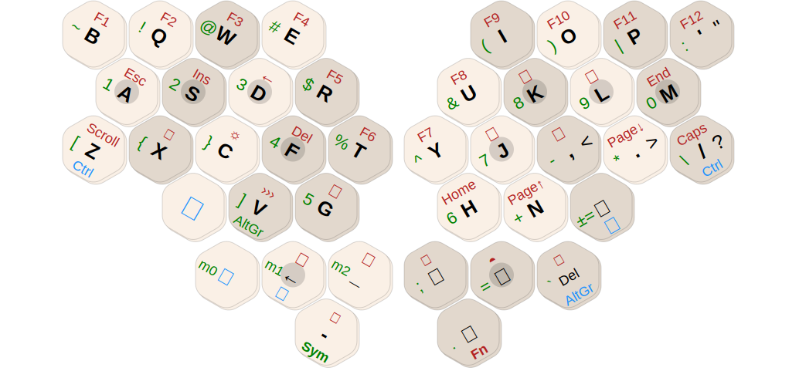

### Columns, Fingers, and Thumbs

Mantis is a column-staggered keyboard, with the columns rotated inwards for comfortable wrists. The shading of the keys in the diagram highlights distinct columns for different fingers, and thumb clusters. The dark circles indicate the home keys for each finger or thumb.

The Alpha layout is mostly QWERTY. But the index fingers have one less key each, so one key from each index finger is moved to a pinkie (**B** and **M**). Each thumb has a cluster of four keys. **Space** is only available on the right thumb. There is only one **Shift** key, and it's on a thumb key to take some load off the pinkies.

### Layers

The default Mantis keymap uses three layers to provide the same functionality as a regular 80% keyboard. Each key performs different functions depending on the layer. Some keys also have a different behaviour when holding rather than tapping them. The layers are depicted with different colors in the diagram above:

- Black: Alpha layer for normal letters with a (nearly) QWERTY layout
- Green: Symbol layer with numbers and symbols
- Red: Function layer with function, navigation and editing keys

Symbol and Function layers are activated by holding **Sym** or **Fn** respectively, similar to how **Shift** works.

**Fn+X** switches between two Alpha layers. By default the alternate layout is based on Colemak-DH.

### Modifiers

The blue legends in the diagram indicate modifiers: Ctrl, Win/OS (⚜), Alt (⎇), Shift (⇧), AltGr. They are usually activated by holding the key, rather than tapping it. Modifiers are the same across most layers, with some caveats for thumb keys.

**Alt** and **Shift** cannot be held comfortably on the Symbol layer, because they use the same thumb as **Sym**. The Symbol layer doesn't need **Shift** by design—shifted symbols have their own keys. **Alt** is a one-shot key. You can tap it instead of holding, to modify the next key that is tapped on any layer.

**AltGr** is needed with some international layouts to access another set of special symbols. The placement on the right thumb allows combinations with **Shift** and **Sym**. To make it usable with symbols on the right thumb, the Symbol layer has a second **AltGr** key on the left index finger. **AltGr** should never be needed on the Function layer.

### Changing the Keymap with Vial

[Vial](https://get.vial.today/) is a GUI that lets you change the keymap easily without having to build and flash new firmware. The keymap is stored on the keyboard itself, so it works the same on any computer you connect your keyboard to.

Some of the things you can do with Vial: Change the primary or alternate Alpha layout, change the Symbol layer to have a number pad instead of a number row, define custom macros, e.g. to type your email address with one tap, change some modifiers to work better with MacOS, try out home-row mods, ...